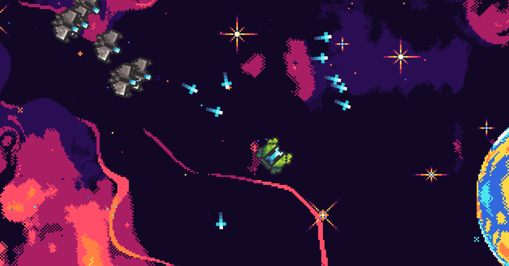

# Enigma Game Engine
A simple game engine. I've wanted to make a game engine for awhile but I haven't had the skills to until resently. Sometimes I thing I still don't have the right skill set.
Big thanks to [The Cherno](https://www.youtube.com/@TheCherno) this project most likely wouldn't exist without him.

## Docs
The `Docs` folder explains everything. 
- Enigma [Get Started](Docs/Enigma/Enigma.md)
- Editor [Get Started](Docs/EnigmaEditor/Editor.md)

## Version / Notes
In the [Enigma.h](Enigma/Enigma/Enigma.h) there should be the current version and a note about what's going on. I'll try to remember that it exists. I'll update it for big commits

## Example Game
To test out the engine I made this simple top down shooter

---
# Setup
## Windows
1. Clone this repo to your device
2. Goto the `Scripts/Windows` directory
3. Run the `Setup.bat` file, this initializes and updates the git submodules
4. Run the `VS_Generate.bat` file, this will create all of the visual studio files
5. Open the .sln file in visual studio

#### Note
All vs files the `VS_Generate.bat` file creates are for visual studio 2019

## Linux
1. Clone this repo to your device
2. Goto the `Scripts/Linux` directory
3. Run the `Setup.sh` file, this initializes and updates the git submodules
4. Run the `Generate.sh` file, this will prompt you in order to generate the correct build system
5. Run the `Run.sh` file in the terminal

#### Note
You may need to give the `.sh` files permission to run, to do this you can use the command `chmod a+x FILE_NAME.sh`